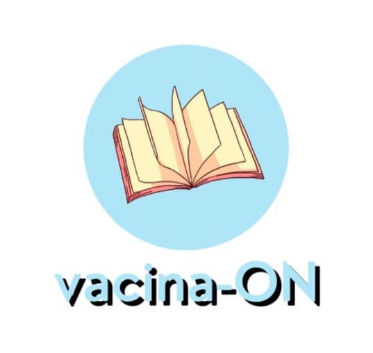
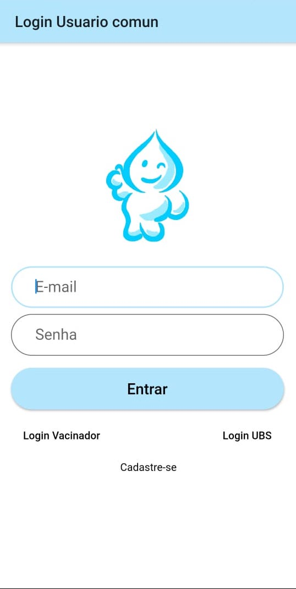
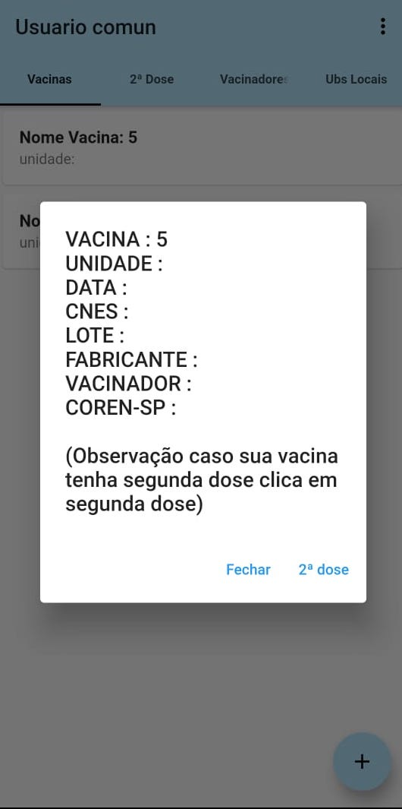
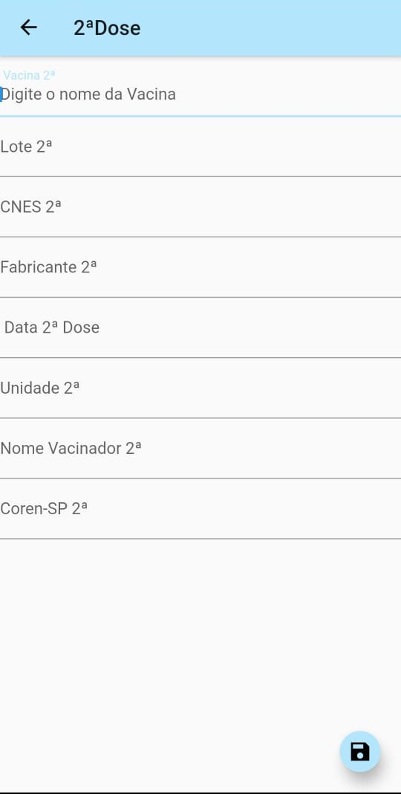

# Vacina ON
> Projeto Integrador do curso de Análise e Desenvolvimento de Sistemas - UNASP-SP.

## 1. Apresentação
<p align="center">
    
</p>

Vacina ON é um sistema baseado em um aplicativo móvel para auxiliar as pessoas e profissionais da saúde a manter de forma prática, a organização e arquitetura de uma carteira de vacinação. Sendo responsável por organizar, agendar e registrar as vacinas recebidas pelo cidadão ao longo da sua vida.
Por meio desse aplicativo, será possivel comprovar quais vacinas o individuo recebeu e também registrar doses futuras, no caso de vacinas com mais de uma dose, podendo assim marcar seu retorno à unidade de saúde.

Nosso objetivo é facilitar o registro das doses aplicadas, permitindo que os usuários controlem sobre as vacinas que tomou e quais ainda falta receber, especialmente vacinas que precisam de mais de uma dose. 
Além disso, agendar um dia e horário com o orgão da saúde (UBS ou Hospital), evitando filas e demora no atendimento.

## 2. Equipe:
Alan Vitoriano da Silva
* RA: 115178
* Função: Dev
* Gituser: [@Alanvitoriano](https://github.com/Alanvitoriano/)

Daniele Barbosa da Silva
* RA: 115196
* Função: Dev
* Gituser: [@daanybarbosa](https://github.com/daanybarbosa)

Gustavo Laureano de Jesus
* RA: 117283
* Função: Dev
* Gituser: [@gulaureano](https://github.com/gulaureano)

Matheus de Oliveira Itajahy
* RA: 117209
* Função: PO
* Gituser: [@itajahy](https://github.com/itajahy)


## 3. Requisitos Funcionais
* Logar: <br>
O sistema deve permitir o login dos individuos: Usuários, UBS e Vacinador.<br>
* Cadastro de Usuários: <br>
O sistema deve permitir o cadastro de novos usuários.<br>
* Cadastro de UBS: <br>
O sistema deve permitir o cadastro de novos postos de vacinação (UBS e Hospitais).<br>
* Cadastro de Vacinadores: <br>
O sistema deve permitir o cadastro dos vacinadores (funcionários das UBS e Hospitais que irão validar a vacinação).<br>
* Cadastro de vacinas 1ª dose: <br>
O sistema deve permitir a inclusão das vacinas disponíveis para 1ª dose.<br> 
* Cadastro de vacinas 2ª dose: <br>
O sistema deve permitir a inclusão das vacinas disponíveis para 2ª dose, caso seja preciso. <br>
* Consulta de histórico de vacinas: <br>
O sistema deve permitir a visualização do histórico das vacinas tomadas pelo o usuário.<br>

#### 3.1. Use Case

<p align="center">
    
</p>
> Use Case 

#### 3.2. Diagrama de Classe (UML)
<p align="center">
    
</p>
> Diagrama de classe para as principais entidades do sistema

#### 3.3. Modelo Entidade Relacionamento
<p align="center">
    
</p>
> Modelo entidade relacionamento


## 4. Tecnologias:

- Flutter
- Dart
- Firebase
- Android SDK
- Java SDK
- Android Nativo


## 5. Apresentação do Sistema

##### Tela inicial
<p align="center">
    
</p>
> Tela inicial do aplicativo

#### Tela para selecionar o login
<p align="center">
    
</p>
> Tela para selecionar o tipo de login: usuário, ubs ou vacinador, ou caso deseje, cadastra-se na plataforma

#### Tela de Login do Usuário
<p align="center">
    
</p>
> Tela de login do usuário, caso seja um vacinador ou UBS possui a possibilidade de realizar a troca para o devido login

#### Selecionar o tipo de Cadastro 
<p align="center">
    
</p>
> Tela para selecionar o tipo de cadastro que será realizado: Usuário, UBS ou Vacinador. 

#### Cadastrar o Usuário
<p align="center">
    
</p>
> Tela para cadastrar o usuário.

#### Cadastrar a UBS
<p align="center">
    
</p>
> Tela para cadastrar a UBS.

#### Cadastrar o Vacinador
<p align="center">
    
</p>
> Tela para cadastrar o vacinador.

#### Cadastrar a 1ª dose da vacina
<p align="center">
    
</p>
> Tela para cadastrar a primeira dose da vacina.

#### Cadastro 2ª dose da vacina
<p align="center">
    
</p>
> Tela que irá aparecer para direcionar o usuário para cadastrar a segunda dose da vacina, caso seja necessário.

<p align="center">
    
</p>
> Tela para cadastrar a segunda dose da vacina.

#### Listagem das vacinas tomadas
<p align="center">
    
</p>
> Tela de listagem de todas as vacinas tomadas pelo o usuário, incluindo as primeiras doses, e caso necessário as segundas doses tomadas.

#### Contatos dos Vacinadores e UBS 
<p align="center">
    
</p>
> Tela dos contatos dos vacinadores e das UBS locais 


## 6. Firebase

#### 6.1. Usuários
<p align="center">
    
</p>

#### 6.2. UBS
<p align="center">
    
</p>

#### 6.3. Vacinador
<p align="center">
    
</p>

#### 6.4. Usuários com a 1ª Dose da Vacina:
<p align="center">
    
</p>

#### 6.5. Usuários com a 2ª Dose da Vacina:
<p align="center">
    
</p>

#### 6.6. Validação das Vacinas
<p align="center">
    
</p>


## 7. Como fazer a Build do aplicativo
**Passo 1:**
Faça o download ou clone esse repositório usando o link:
``` https://github.com/Alanvitoriano/cardenetadevascina-ao-tcc.git ```

**Passo 2:**
Instale o Flutter no Windows

* Baixe o arquivo zip da última versão do Flutter SDK. 
``` https://flutter.dev/docs/get-started/install/windows#system-requirements ```

* Extraia o arquivo zip com o Flutter SDK para uma pasta onde não sejam necessários privilégios de administrador. 

* Para usar o Flutter CLI (interface de linha de comandos) diretamente em qualquer linha de comando, os seguintes passos são necessários:
    * Vá em Painel de Controle > Contas de usuário > Alterar as variáveis do meu ambiente.
    * Na seção de variáveis de ambiente de usuário, procure a variável chamada “Path”.
    * Adicione à variável “Path” o caminho para a pasta C:/flutter/bin.

* Execute no terminal do Windows o comando ``` flutter doctor ```, para que ele dê o diagnóstico completo e informe se a instalação foi realizada corretamente. Caso ainda haja pendências, ele dirá quais são e como resolvê-las.

* Para rodar o projeto, execute o comando ``` flutter run ```.


## 8. Referências

- <https://www.figma.com/file/s819tsMP9PcAd7CRwLddwD/Untitled?node-id=0%3A1>
- <https://github.com/Alanvitoriano/cardenetadevascina-ao-tcc>
- <https://flutter.dev/docs/get-started/install/windows#system-requirements>
